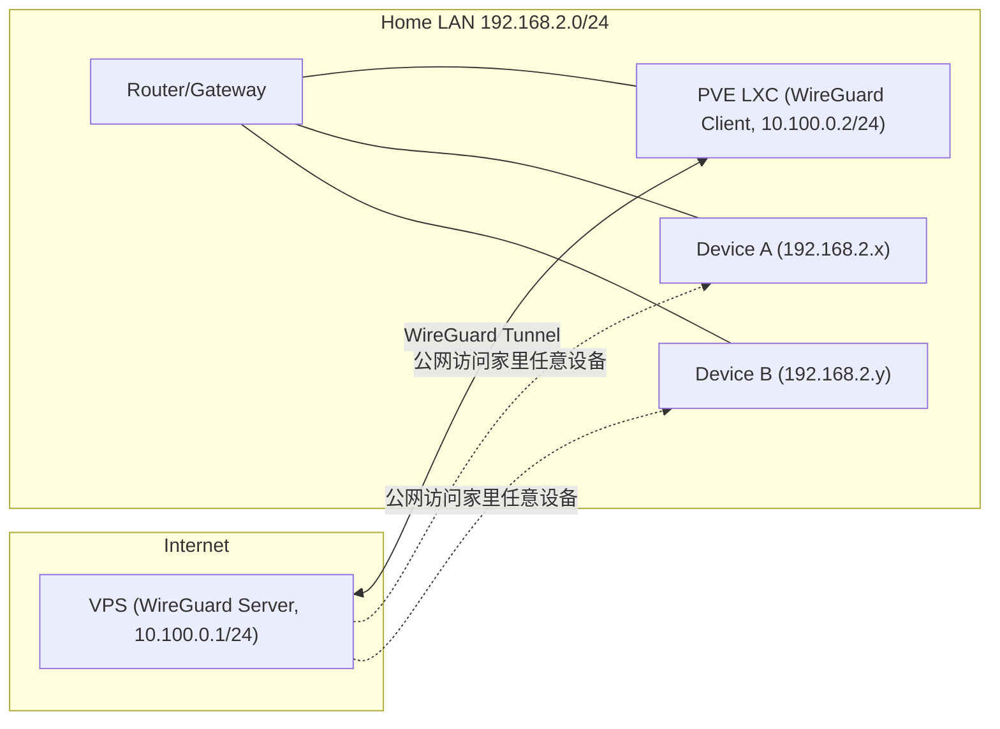

# WireGuard 安装与组网实战（VPS <-> 家庭网络）

## 为什么选择 WireGuard

FRP / Ngrok 虽然上手快，但我用起来不够稳定省心。Tailscale 体验很好，不过它的 IP 规划与组网概念对我来说有点“黑盒”。

WireGuard 刚好相反：协议轻量、性能强、配置直观，而且安全性非常扎实。最重要的是，我可以通过 VPS 像在同一个局域网里一样访问家里的设备，并且把家庭服务有控制地暴露到公网。

## 适用场景

- 有一台公网 VPS
- 家里有固定局域网（比如 192.168.2.0/24）
- 想从公网访问家里设备，或把家里服务对外开放

## 网络拓扑



## 前置准备

- 规划一段独立的 WireGuard 子网（示例使用 10.100.0.0/24）
- VPS 放行 WireGuard 端口（例如 51820/UDP）
- 确认家庭网段（示例为 192.168.2.0/24）

## 安装和配置 WireGuard 服务端

我在阿里云的 99 元 VPS 上安装 WireGuard。

1. 安装 WireGuard

    ```bash
    sudo apt update
    sudo apt install wireguard
    ```

2. 生成密钥对

    ```bash
    wg genkey | tee privatekey | wg pubkey > publickey
    ```

3. 配置 WireGuard 服务端

    编辑 `/etc/wireguard/wg0.conf` 文件：

    ```ini
    [Interface]
    Address = 10.100.0.1/24
    ListenPort = <服务端端口>
    PrivateKey = <服务端私钥>
    PostUp = iptables -A FORWARD -i %i -j ACCEPT; iptables -A FORWARD -o %i -j ACCEPT
    PostDown = iptables -D FORWARD -i %i -j ACCEPT; iptables -D FORWARD -o %i -j ACCEPT

    [Peer]
    PublicKey = <客户端公钥>
    AllowedIPs = 10.100.0.2/32, 192.168.2.0/24
    ```

4. 启动 WireGuard 服务

    ```bash
    sudo wg-quick up wg0
    ```

## 配置 WireGuard 客户端

我在本地小主机 PVE 上单独开了一个 LXC 容器作为 WireGuard 客户端。

1. 安装 WireGuard

    ```bash
    sudo apt update
    sudo apt install wireguard
    ```

2. 生成密钥对

    ```bash
    wg genkey | tee privatekey | wg pubkey > publickey
    ```

3. 配置 WireGuard 客户端

    编辑 `/etc/wireguard/wg0.conf` 文件：

    ```ini
    [Interface]
    PrivateKey = <客户端私钥>
    Address = 10.100.0.2/24
    PostUp = iptables -A FORWARD -i %i -j ACCEPT; iptables -t nat -A POSTROUTING -o eth0 -j MASQUERADE
    PostDown = iptables -D FORWARD -i %i -j ACCEPT; iptables -t nat -D POSTROUTING -o eth0 -j MASQUERADE

    [Peer]
    PublicKey = <服务端公钥>
    Endpoint = <服务端IP>:<服务端端口>
    AllowedIPs = 10.100.0.0/24
    PersistentKeepalive = 25
    ```

4. 启动 WireGuard 客户端

    ```bash
    sudo wg-quick up wg0
    ```

## 测试连接

在服务端运行（尝试访问家庭设备 IP）：

```bash
ping 192.168.2.x  # 替换为客户端的局域网 IP
```

如果能 ping 通，说明路由已经生效。

## 常见问题与注意事项

- 公网 VPS 需要放行 UDP 端口（通常 51820/UDP）
- ping 不通时，优先排查：端口放行、路由是否正确、AllowedIPs 是否包含家庭网段
- 如果需要让家庭网段走公网，可在客户端（家庭侧）开启 NAT（本文示例已配置）

## 配置 Nginx 反向代理

在 VPS 上配置 Nginx，把公网请求转发到家庭网络中的任意设备（通过 WireGuard 内网可直达）。这样外网访问 VPS 的域名或端口，就等于访问家里的服务。

示例（将 `home.example.com` 转发到家里 NAS 的 192.168.2.10:8080）：

```nginx
server {
    listen 80;
    server_name home.example.com;

    location / {
        proxy_pass http://192.168.2.10:8080;
        proxy_set_header Host $host;
        proxy_set_header X-Real-IP $remote_addr;
        proxy_set_header X-Forwarded-For $proxy_add_x_forwarded_for;
        proxy_set_header X-Forwarded-Proto $scheme;
    }
}
```
